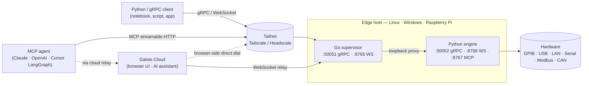

<h1 align="center">galois edge</h1>

<p align="center">
  <strong>The missing hardware layer for AI agents. One daemon, every protocol — your agent talks gRPC or MCP, your hardware talks whatever it wants.</strong>
</p>

<p align="center">
  <a href="https://docs.galoislabs.ai">Docs</a> ·
  <a href="https://docs.galoislabs.ai/getting-started/quickstart/">Quickstart</a> ·
  <a href="https://github.com/Galois-Labs/edge/releases">Releases</a> ·
  <a href="https://cloud.galoislabs.ai">Galois Cloud</a> ·
  <a href="https://docs.galoislabs.ai/changelog/">Changelog</a>
</p>

<p align="center">
  <a href="https://github.com/Galois-Labs/edge/releases"></a>
  <a href="./LICENSE"></a>
  <a href="https://github.com/Galois-Labs/edge/actions/workflows/release.yml"></a>
  
  
  
</p>

<p align="center">
  
</p>

---

AI agents are good at calling APIs. They're terrible at talking to instruments, PLCs, and CAN-bus devices — every vendor has its own protocol, every protocol has its own client library, every library was written by humans for humans.

`galois-edge` is the missing layer: a single binary that gives any agent (or any program in any language) a unified, typed, network-addressable handle on every piece of hardware in your lab, factory, or rig. Connect the daemon to your gear once; every connected device shows up as a typed MCP tool, a typed gRPC RPC, or a familiar `pyvisa.ResourceManager("@galois")` if you're coming from existing scripts.

Full documentation lives at **[docs.galoislabs.ai](https://docs.galoislabs.ai)**.

## One API. Every bus.

Most hardware-control projects ship one transport per protocol: PyVISA for SCPI, pymodbus for industrial, python-can for automotive, libftdi for serial, none of them speaking the same shape. `galois-edge` is one daemon that owns all of them and exposes a single, typed interface upstream.

| Protocol | Bus / wire | What plugs in |
|---|---|---|
| **GPIB** | linux-gpib (Agilent 82357B, NI USB-GPIB-HS, …) | SCPI lab gear |
| **USBTMC** | PyVISA USB transport | Bench DMMs, scopes, AWGs, SMUs |
| **Raw USB** | pyusb | Vendor-specific USB devices (lock-in amplifiers, etc.) |
| **LXI / VXI-11 / HiSLIP** | mDNS auto-discovery | Network-attached lab gear |
| **Serial / USB-serial** | pyserial (FTDI · Prolific · CH340 · CP210x) | RS-232/485, USB-CDC adapters |
| **Modbus** | TCP and RTU | PLCs, drives, energy meters, pumps, valves |
| **CAN** | python-can (SocketCAN, PCAN, Vector, …) | Automotive ECUs, robotics, industrial sensors |
| **Vendor SDKs** | Python proxy (MultiPyVu, niscope, dwfpy, …) | Non-SCPI hardware with a Python library |
|**SPI** | spidev (lib and python) | GPIOs/adapters |
|**I2C** | smbus2, etc | GPIOs/adapters |

The agent (or your script) calls `keysight_34461a__measure_voltage_dc()`, `siemens_s71200__read_holding_register(addr=40001)`, or `dps150__set_voltage(value=3.3)` — same shape, same auth, same audit log, same fleet view in the cloud.

## Who it's for

- **Lab & test.** SCPI instruments on GPIB, USBTMC, and LXI. Drop-in for existing PyVISA scripts; scale up to typed agent-driven sweeps and characterization. The bundled profile library covers Keithley, Keysight, R&S, Tektronix, Lake Shore, SRS, Rigol, and 100+ other vendors — full list at [galoislabs.ai/instruments](https://www.galoislabs.ai/instruments).
- **Industrial automation.** Modbus TCP and RTU expose every PLC tag, drive setpoint, and energy meter through the same typed-tool surface as the lab gear. An agent reads a PLC, writes a setpoint, watches an alarm, and pushes to a historian — without per-vendor glue.
- **Robotics & automotive.** CAN-bus devices and serial sensors stream into the same gRPC contract. Whether the agent is reading an oscilloscope, an engine ECU, or a robot joint encoder, both sides see the same shape: typed RPCs returning timestamped values.

## Install

```sh
curl -fsSL https://galoislabs.ai/install.sh | sudo sh
```

The installer drops `galois-edge` and `galois-edge-daemon` into `/usr/local/bin`, installs udev rules for USBTMC and USB-serial vendors, registers a systemd unit, and starts the service. To register with the cloud at install time, pass an API key from your dashboard:

```sh
curl -fsSL https://galoislabs.ai/install.sh | sudo sh -s -- --token glc_XXXXXXXX
```

Windows (MSI) and manual install steps are in the [installation guide](https://docs.galoislabs.ai/getting-started/installation/).

## Use it

### From an agent (MCP)

Point any MCP client at the daemon and every connected device shows up as a typed tool. Works with Anthropic API's `mcp_servers` connector, Claude Desktop, Cursor, OpenAI Agents SDK, LangGraph, LlamaIndex — anything that speaks Model Context Protocol.

```jsonc
// Claude Desktop — claude_desktop_config.json
{
  "mcpServers": {
    "galois-edge": {
      "url": "http://lab-pi.tail-1234.ts.net:8767/mcp"
    }
  }
}
```

The agent now sees per-instrument typed tools (`keithley_2400__source_voltage(value, unit)`, `siemens_s71200__read_holding_register(addr)`), plus generic tools (`list_instruments`, `get_capabilities`, `start_sweep`, `start_stream`). Three things make this genuinely first-class for tool-use, not just MCP-shaped:

- **Runtime capability discovery.** `tools/list` reflects every connected instrument with typed parameters, units, ranges, and `is_dangerous` flags pulled live from profile YAML — no agent needs to read a vendor manual.
- **Hot-plug surfaces in milliseconds.** Plug in a new oscilloscope, the daemon profile-matches it, and `notifications/tools/list_changed` fires; the agent's tool catalogue updates without a session restart.
- **Daemon-resident long-running ops.** `start_sweep` returns a handle and the ramp continues on the daemon. `start_stream` maps each measurement point to an MCP `notifications/progress`. An agent session can drop, hand off, or sleep without stranding hardware.

### From a notebook (PyVISA)

If you already have PyVISA scripts, change the backend string and they keep working — every connected device is reachable through the `@galois` backend.

```python
import pyvisa

rm = pyvisa.ResourceManager("@galois")
dmm = rm.open_resource("USB0::0x2A8D::0x0101::MY54505555::INSTR")
print(dmm.query("*IDN?"))
print(float(dmm.query("MEAS:VOLT:DC?")))
```

Or use the typed [`galois` Python SDK](https://docs.galoislabs.ai/guides/python-sdk/) for sync/async, NumPy-decoded waveforms, and daemon-resident sweeps:

```python
import galois

with galois.Edge.connect("lab-pi.tail-1234.ts.net:50051") as edge:
    smu = edge.instrument("GPIB0::24::INSTR")
    smu.execute("set_voltage", value=1.5)
    print(smu.execute("measure_current"))
```

### From any language (gRPC)

The proto contract under [`proto/edge/v1/edge.proto`](./proto/edge/v1/edge.proto) is the canonical surface. Generate stubs in any language `buf` supports.

```sh
grpcurl -plaintext lab-pi:50051 galois.edge.v1.EdgeDaemonService/ListInstruments
```

Full reference at the [daemon API docs](https://docs.galoislabs.ai/reference/daemon-api/).

## How it works



The Go binary owns config, lifecycle, the system service, the embedded Tailscale node, the WebSocket relay client, and a gRPC proxy from the external port to the loopback port the Python engine binds. The Python engine owns hardware I/O — discovery, profile matching, command dispatch, sweeps, streaming.

## What's in the box

- **Single binary.** Go supervisor plus a frozen Python engine. No Python runtime, no Docker, no dependencies on the target host.
- **Bundled drivers and YAML profiles.** Write your own, drop them in the profile dir, or push them through Galois Cloud to a fleet of daemons. The current supported list is at [galoislabs.ai/instruments](https://www.galoislabs.ai/instruments).
- **Sweeps.** Safety-aware ramps for magnets and temperature controllers. Sweep state lives on the daemon, so client drops don't strand hardware.
- **Streaming.** gRPC server-streaming, a multi-stream WebSocket protocol (32 streams/socket), and MCP progress notifications — with NumPy decoding for waveforms.
- **Vendor SDK proxy.** Typed agent-callable tools wrap Python vendor libraries (MultiPyVu, niscope, dwfpy, …) for non-SCPI hardware (PPMS controllers, NI modular instruments, Digilent boards, …).
- **Optional cloud.** When `BACKEND_URL` is set, the daemon joins a Tailscale tailnet and a WebSocket relay so the cloud can dispatch even without direct gRPC dial, and pulls driver/profile updates from the dashboard.

## Roadmap

Tracking against the post-v0.1 capability-gap wave. Full detail in the [changelog](https://docs.galoislabs.ai/changelog/).

**Shipped**
- ✅ Multi-stream WebSocket protocol (32 streams/socket, per-instrument SCPI lock)
- ✅ gRPC bearer-token auth (`INBOUND_AUTH_TOKEN`) with `setup`-driven provisioning
- ✅ 13-check `galois-edge doctor` (config, Python health, USB/GPIB, tailnet, backend)
- ✅ Auto-attached PyVISA proxy — profile commands directly on the resource
- ✅ Relay client hardening (auth header, close-code handling, `hello_ack` build tag)
- ✅ Env-var reconciliation + unknown-var startup guard
- ✅ Windows MSI installer with code-signing pipeline (gated on signing secrets)
- ✅ MCP server at `/mcp` — static + dynamic per-instrument typed tools, real `StreamMeasurement` → progress notifications, typed SDK wrappers replacing opaque `ProxySDKCall`

**In progress**
- 🚧 Typed `galois` Python SDK (separate repo) — Edge / Cloud / Instrument / Stream / Sweep / Waveform
- 🚧 Cloud-routed access through `Cloud.connect(backend_url, token).edge(name)`
- 🚧 Public-internet MCP via the cloud relay — `https://cloud.galoislabs.ai/mcp/<edge_id>` with per-call JWT-scoped ACLs (daemon side shipped, cloud side in review)
- 🚧 SPI/I2C/OPC-UA support (check branches)
- 🚧 CAN-FD support for more adapters/manufacturers/SOMs like the iMX8, etc

**Planned**
- 📋 Profile-defined safety interlocks for sweeps (per-instrument abort SCPI is in; declarative bounds next)
- 📋 First-class hot-plug on Linux via `pyudev` (currently behind the `hotplug` extra)
- 📋 macOS support (today: Linux + Windows + Pi)

## Repo layout

```
cmd/galois-edge/         Go supervisor entry point (CLI + service)
cmd/galois-edge-tray/    Windows system-tray helper
internal/                Go: config, doctor, supervisor, relay, registration, proxy, …
src/galois_edge/         Python engine (gRPC server, instrument managers, profile loader)
src/galois_edge/profiles/  Bundled YAML hardware profiles
src/galois_edge/drivers/   Protocol drivers (Modbus, CAN, serial)
proto/edge/v1/edge.proto Canonical service contract
installer/               Windows MSI (WiX) sources
scripts/                 Build, package, release helpers
tests/                   pytest suite for the Python engine
docs/                    Internal architecture and implementation notes
```

## Build from source

Requires Go 1.26+, Python 3.10+, and `buf` if you regenerate protobufs.

```sh
# Go binary
make build              # → ./galois-edge

# Python engine (editable)
pip install -e '.[dev]'

# Frozen engine binary (PyInstaller)
make freeze             # → ./dist/galois-edge-daemon

# Run tests
pytest tests/ -v
go test ./...
```

See the [Makefile](./Makefile) for the full target list.

## Diagnostics

```sh
galois-edge doctor
```

Runs 13 checks: binary location, disk space, config, Python health, USB permissions, GPIB driver, backend reachability, tailnet, and more. Exits non-zero on failure — wire it into provisioning. `--json` for machine-readable output.

## Configuration

A single `KEY=VALUE` file at `/etc/galois-edge/config.env` (Linux) or `C:\ProgramData\galois-edge\config.env` (Windows). Manage it with:

```sh
galois-edge configure list
galois-edge configure set GRPC_PORT 50061
```

Every key, default, and validation rule is in the [configuration reference](https://docs.galoislabs.ai/getting-started/configuration/).

## Status

Pre-1.0. The gRPC contract under `proto/edge/v1/edge.proto` is the stable surface; the Go and Python internals will continue to move. Tagged releases land on `main` as `v<major>.<minor>.<patch>` — binaries, MSI, and SHA-256 checksums attach to each [GitHub release](https://github.com/Galois-Labs/edge/releases).

## License

Apache License 2.0 — see [LICENSE](./LICENSE).
