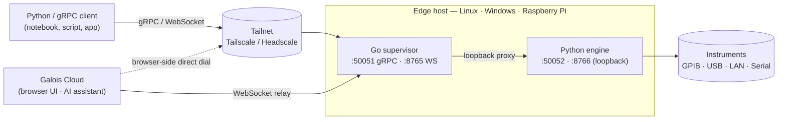

<p align="center">
  <picture>
    <source media="(prefers-color-scheme: dark)" srcset=".github/assets/logo-dark.svg">
    
  </picture>
</p>

<h1 align="center">galois-edge</h1>

<p align="center">
  <strong>The R&amp;D operating system for hardware teams — a single network endpoint for every instrument in the lab.</strong>
</p>

<p align="center">
  <a href="https://docs.galoislabs.ai">Docs</a> ·
  <a href="https://docs.galoislabs.ai/getting-started/quickstart/">Quickstart</a> ·
  <a href="https://releases.galoislabs.ai">Releases</a> ·
  <a href="https://cloud.galoislabs.ai">Galois Cloud</a> ·
  <a href="https://docs.galoislabs.ai/changelog/">Changelog</a>
</p>

<p align="center">
  <a href="https://github.com/Galois-Labs/edge/releases"></a>
  <a href="https://github.com/Galois-Labs/edge/blob/main/LICENSE"></a>
  <a href="https://github.com/Galois-Labs/edge/actions"></a>
  
  
  
</p>

<p align="center">
  
</p>

---

`galois-edge` discovers instruments on GPIB, USB, LAN, and serial buses, identifies them against 130+ bundled YAML profiles, and exposes them through gRPC, WebSocket, and a drop-in PyVISA backend. It runs as a system service, joins a Tailscale/Headscale tailnet for zero-config remote access, and optionally registers with [Galois Cloud](https://cloud.galoislabs.ai) for browser-based control, multi-user workspaces, and the AI assistant.

Full documentation lives at **[docs.galoislabs.ai](https://docs.galoislabs.ai)**.

## Install

```sh
curl -fsSL https://galoislabs.ai/install.sh | sudo sh
```

The installer drops `galois-edge` and `galois-edge-daemon` into `/usr/local/bin`, installs udev rules for USBTMC and USB-serial vendors, registers a systemd unit, and starts the service. To register with the cloud at install time, pass an API key from your dashboard:

```sh
curl -fsSL https://galoislabs.ai/install.sh | sudo sh -s -- --token glc_XXXXXXXX
```

Windows (MSI) and manual install steps are in the [installation guide](https://docs.galoislabs.ai/getting-started/installation/).

## Talk to instruments

```python
import pyvisa

rm = pyvisa.ResourceManager("@galois")          # one line — done
print(rm.list_resources())

dmm = rm.open_resource("USB0::0x2A8D::0x0101::MY54505555::INSTR")
print(dmm.query("*IDN?"))
print(dmm.query("MEAS:VOLT:DC?"))
```

Or use the typed [`galois` Python SDK](https://docs.galoislabs.ai/guides/python-sdk/):

```python
import galois

with galois.Edge.connect("lab-pi.tail-1234.ts.net:50051") as edge:
    smu = edge.instrument("GPIB0::24::INSTR")
    smu.execute("set_voltage", value=1.5)
    print(smu.execute("measure_current"))
```

Or call the gRPC API from any language — see the [daemon API reference](https://docs.galoislabs.ai/reference/daemon-api/).

## How it works



The Go binary owns config, lifecycle, the system service, the embedded Tailscale node, the WebSocket relay client, and a gRPC proxy from the external port to the loopback port the Python engine binds. The Python engine owns instrument I/O — discovery, profile matching, command dispatch, sweeps, streaming.

## What's in the box

- **Single binary** — Go supervisor plus a frozen Python instrument engine. No Python runtime, no Docker, no dependencies on the target host.
- **130+ instrument profiles** with named commands and typed parameters — see the full list below.
- **Auto-discovery** on GPIB (linux-gpib), USBTMC, raw USB (pyusb), LXI mDNS, and USB-serial.
- **Sweeps** — safety-aware ramps for magnets and temperature controllers. Sweep state lives on the daemon, so client drops don't strand hardware.
- **Streaming** — gRPC server-streaming and a multi-stream WebSocket protocol (32 streams/socket) with NumPy decoding for waveforms.
- **Vendor SDK relay** — `ProxySDKCall` invokes Python vendor libraries (MultiPyVu, niscope, dwfpy, …) installed alongside the daemon for non-SCPI instruments.
- **Optional cloud** — when `BACKEND_URL` is set, the daemon joins a Tailscale tailnet and a WebSocket relay so the cloud can dispatch even without direct gRPC dial.

<details>
<summary><strong>Supported instruments (131 profiles)</strong></summary>

| Vendor | Profiles |
|---|---|
| **Keysight / Agilent / HP** | 33500B, 34401A, 34461A, 34970A, B1500A, DSOX3000, E36300, E3631A, E4980A, E5080B, M8195 AWG, MXG, N1913A, N9000B, PSG, PXI AWG / Digitizer / HVI Trigger / LO, S-series scope · 4156C, E4440A, E5071C · HP 33120A, 3478A DMM, 4284A, 53131A, 6632B, 8648 |
| **Tektronix / Keithley** | AFG31000, DMM4050, MSO2000/3000/4000/56, TDS2000 · Keithley 2000, 2010, 2182A, 2280S, 2400, 2450, 2600B, 2700, 6221, 6430, 6485, 6517B, DAQ6510, DMM6500 |
| **Rohde &amp; Schwarz / Hameg** | FSW, HMP4000, RTB2004, SGS100A, ZNB · Hameg HM813x |
| **Stanford Research (SRS)** | CS580, CTC100, DG645, DS345, PTC10, SR715, SR830, SR860, SR865A |
| **Rigol** | DG1000Z, DG4000, DHO800, DM3058, DP800, DS1000Z, DSA800 |
| **Siglent** | SDG2000X, SDM3045X, SDS1000X |
| **Yokogawa** | 7651, GS200, WT3000, WT5000 |
| **Lake Shore** | 335, 336, 372 (dilution-fridge), 460 |
| **National Instruments** | DAQ, DCPower, DMM, FGEN, Scope, USB-6218 |
| **Oxford Instruments** | ILM, IPS120, Mercury IPS, PS120 |
| **Zurich Instruments** | HDAWG, MFLI, UHFLI |
| **Cryogenics &amp; magnets** | Cryomagnetics LM-510 · BlueFors logging · Triton · Leiden pressure |
| **Quantum Design** | PPMS (MultiPyVu) |
| **Lock-ins / preamps** | Signal Recovery 7265, 7270 |
| **Power / loads** | BK Precision 8600, Chroma 63600, GW Instek GPP |
| **DMMs / counters** | Fluke 8845A · Advantest R8340 |
| **Sources / synthesizers** | Holzworth HS9000, Lab Brick LMS / LSG, Marconi 2026, BNC 645, Vaunix attenuator |
| **Spectrum / network** | Anritsu MS2830A / MS4640A, Signal Hound, SignaDyne AWG / Digitizer, Tabor SE5082 AWG, Acqiris U1084A, AlazarTech digitizer |
| **Switching / motion** | Mini-Circuits MW &amp; RF switches · Newport MM4006 stage |
| **PXI &amp; misc** | Aeroflex 302x / 303x · LeCroy T3DSO · Digilent Analog Discovery · Ocean Optics spectrometer · WITec |

</details>

## Roadmap

Tracking against the post-v0.1 capability-gap wave. Full detail in the [changelog](https://docs.galoislabs.ai/changelog/).

**Shipped**
- ✅ Multi-stream WebSocket protocol (32 streams/socket, per-instrument SCPI lock)
- ✅ gRPC bearer-token auth (`INBOUND_AUTH_TOKEN`) with `setup`-driven provisioning
- ✅ 13-check `galois-edge doctor` (config, Python health, USB/GPIB, tailnet, backend)
- ✅ Auto-attached PyVISA proxy — profile commands directly on the resource
- ✅ Relay client hardening (auth header, close-code handling, `hello_ack` build tag)
- ✅ Env-var reconciliation + unknown-var startup guard
- ✅ Windows MSI installer with code-signing pipeline (gated on signing secrets)

**In progress**
- 🚧 Typed `galois` Python SDK (separate repo) — Edge / Cloud / Instrument / Stream / Sweep / Waveform
- 🚧 Cloud-routed access through `Cloud.connect(backend_url, token).edge(name)`

**Planned**
- 📋 Profile-defined safety interlocks for sweeps (per-instrument abort SCPI is in; declarative bounds next)
- 📋 First-class hot-plug on Linux via `pyudev` (currently behind the `hotplug` extra)
- 📋 macOS support (today: Linux + Windows + Pi)

## Repo layout

```
cmd/galois-edge/         Go supervisor entry point (CLI + service)
cmd/galois-edge-tray/    Windows system-tray helper
internal/                Go: config, doctor, supervisor, relay, registration, proxy, …
src/galois_edge/         Python engine (gRPC server, instrument managers, profile loader)
src/galois_edge/profiles/  130+ bundled YAML instrument profiles
proto/edge/v1/edge.proto Canonical service contract
installer/               Windows MSI (WiX) sources
scripts/                 Build, package, release helpers
tests/                   pytest suite for the Python engine
docs/                    Internal architecture and implementation notes
```

## Build from source

Requires Go 1.26+, Python 3.10+, and `buf` if you regenerate protobufs.

```sh
# Go binary
make build              # → ./galois-edge

# Python engine (editable)
pip install -e '.[dev]'

# Frozen engine binary (PyInstaller)
make freeze             # → ./dist/galois-edge-daemon

# Run tests
pytest tests/ -v
go test ./...
```

See the [Makefile](./Makefile) for the full target list.

## Diagnostics

```sh
galois-edge doctor
```

Runs 13 checks: binary location, disk space, config, Python health, USB permissions, GPIB driver, backend reachability, tailnet, and more. Exits non-zero on failure — wire it into provisioning. `--json` for machine-readable output.

## Configuration

A single `KEY=VALUE` file at `/etc/galois-edge/config.env` (Linux) or `C:\ProgramData\galois-edge\config.env` (Windows). Manage it with:

```sh
galois-edge configure list
galois-edge configure set GRPC_PORT 50061
```

Every key, default, and validation rule is in the [configuration reference](https://docs.galoislabs.ai/getting-started/configuration/).

## Status

Pre-1.0. The gRPC contract under `proto/edge/v1/edge.proto` is the stable surface; the Go and Python internals will continue to move. Tagged releases land on `main` as `v<major>.<minor>.<patch>`; per-release artifacts and SHA-256 checksums live at [releases.galoislabs.ai](https://releases.galoislabs.ai).

## License

MIT — see [LICENSE](./LICENSE).
