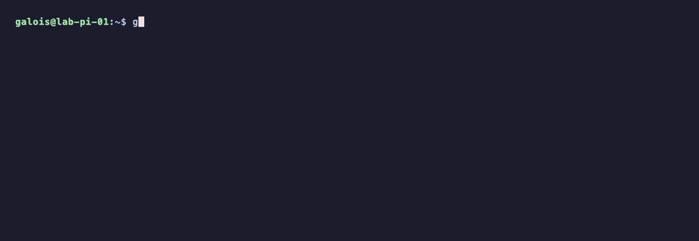
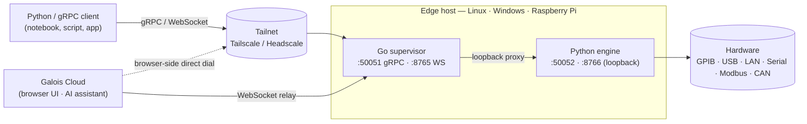

<h1 align="center">galois edge</h1>

<p align="center">
  <strong>A single-binary daemon that exposes lab and industrial hardware over gRPC, WebSocket, and PyVISA — across GPIB, USB, LAN, serial, Modbus, and CAN.</strong>
</p>

<p align="center">
  <a href="https://docs.galoislabs.ai">Docs</a> ·
  <a href="https://docs.galoislabs.ai/getting-started/quickstart/">Quickstart</a> ·
  <a href="https://github.com/Galois-Labs/edge/releases">Releases</a> ·
  <a href="https://cloud.galoislabs.ai">Galois Cloud</a> ·
  <a href="https://docs.galoislabs.ai/changelog/">Changelog</a>
</p>

<p align="center">
  <a href="https://github.com/Galois-Labs/edge/releases"></a>
  <a href="./LICENSE"></a>
  <a href="https://github.com/Galois-Labs/edge/actions/workflows/release.yml"></a>
  
  
  
</p>

<p align="center">
  
</p>

---

`galois-edge` discovers hardware on GPIB, USB, LAN, serial, Modbus, and CAN buses, identifies it against bundled drivers and YAML profiles, and exposes it through gRPC, WebSocket, and a drop-in PyVISA backend. It runs as a system service, joins a Tailscale/Headscale tailnet for zero-config remote access, and optionally registers with [Galois Cloud](https://cloud.galoislabs.ai) for browser-based control, fleet management, and driver distribution.

Full documentation lives at **[docs.galoislabs.ai](https://docs.galoislabs.ai)**.

## Install

```sh
curl -fsSL https://galoislabs.ai/install.sh | sudo sh
```

The installer drops `galois-edge` and `galois-edge-daemon` into `/usr/local/bin`, installs udev rules for USBTMC and USB-serial vendors, registers a systemd unit, and starts the service. To register with the cloud at install time, pass an API key from your dashboard:

```sh
curl -fsSL https://galoislabs.ai/install.sh | sudo sh -s -- --token glc_XXXXXXXX
```

Windows (MSI) and manual install steps are in the [installation guide](https://docs.galoislabs.ai/getting-started/installation/).

## Talk to instruments

```python
import pyvisa

rm = pyvisa.ResourceManager("@galois")          # one line — done
print(rm.list_resources())

dmm = rm.open_resource("USB0::0x2A8D::0x0101::MY54505555::INSTR")
print(dmm.query("*IDN?"))
print(dmm.query("MEAS:VOLT:DC?"))
```

Or use the typed [`galois` Python SDK](https://docs.galoislabs.ai/guides/python-sdk/):

```python
import galois

with galois.Edge.connect("lab-pi.tail-1234.ts.net:50051") as edge:
    smu = edge.instrument("GPIB0::24::INSTR")
    smu.execute("set_voltage", value=1.5)
    print(smu.execute("measure_current"))
```

Or call the gRPC API from any language — see the [daemon API reference](https://docs.galoislabs.ai/reference/daemon-api/).

## How it works



The Go binary owns config, lifecycle, the system service, the embedded Tailscale node, the WebSocket relay client, and a gRPC proxy from the external port to the loopback port the Python engine binds. The Python engine owns hardware I/O — discovery, profile matching, command dispatch, sweeps, streaming.

## What's in the box

- **Single binary** — Go supervisor plus a frozen Python engine. No Python runtime, no Docker, no dependencies on the target host.
- **Bundled drivers and YAML profiles** for laboratory test equipment. Write your own profiles, drop them in the profile dir, or push them through Galois Cloud to a fleet of daemons. The current supported list is at **[galoislabs.ai/instruments](https://www.galoislabs.ai/instruments)**.
- **Multi-protocol discovery** on GPIB (linux-gpib), USB (USBTMC + raw pyusb), LXI mDNS, USB-serial, Modbus (TCP and RTU), and CAN.
- **Sweeps** — safety-aware ramps for magnets and temperature controllers. Sweep state lives on the daemon, so client drops don't strand hardware.
- **Streaming** — gRPC server-streaming and a multi-stream WebSocket protocol (32 streams/socket) with NumPy decoding for waveforms.
- **Vendor SDK relay** — `ProxySDKCall` invokes Python vendor libraries installed alongside the daemon for non-SCPI hardware (PPMS controllers, NI modular instruments, Digilent boards, …).
- **Optional cloud** — when `BACKEND_URL` is set, the daemon joins a Tailscale tailnet and a WebSocket relay so the cloud can dispatch even without direct gRPC dial, and pulls driver/profile updates from the dashboard.

## Roadmap

Tracking against the post-v0.1 capability-gap wave. Full detail in the [changelog](https://docs.galoislabs.ai/changelog/).

**Shipped**
- ✅ Multi-stream WebSocket protocol (32 streams/socket, per-instrument SCPI lock)
- ✅ gRPC bearer-token auth (`INBOUND_AUTH_TOKEN`) with `setup`-driven provisioning
- ✅ 13-check `galois-edge doctor` (config, Python health, USB/GPIB, tailnet, backend)
- ✅ Auto-attached PyVISA proxy — profile commands directly on the resource
- ✅ Relay client hardening (auth header, close-code handling, `hello_ack` build tag)
- ✅ Env-var reconciliation + unknown-var startup guard
- ✅ Windows MSI installer with code-signing pipeline (gated on signing secrets)

**In progress**
- 🚧 Typed `galois` Python SDK (separate repo) — Edge / Cloud / Instrument / Stream / Sweep / Waveform
- 🚧 Cloud-routed access through `Cloud.connect(backend_url, token).edge(name)`

**Planned**
- 📋 Profile-defined safety interlocks for sweeps (per-instrument abort SCPI is in; declarative bounds next)
- 📋 First-class hot-plug on Linux via `pyudev` (currently behind the `hotplug` extra)
- 📋 macOS support (today: Linux + Windows + Pi)

## Repo layout

```
cmd/galois-edge/         Go supervisor entry point (CLI + service)
cmd/galois-edge-tray/    Windows system-tray helper
internal/                Go: config, doctor, supervisor, relay, registration, proxy, …
src/galois_edge/         Python engine (gRPC server, instrument managers, profile loader)
src/galois_edge/profiles/  Bundled YAML hardware profiles
src/galois_edge/drivers/   Protocol drivers (Modbus, CAN, serial)
proto/edge/v1/edge.proto Canonical service contract
installer/               Windows MSI (WiX) sources
scripts/                 Build, package, release helpers
tests/                   pytest suite for the Python engine
docs/                    Internal architecture and implementation notes
```

## Build from source

Requires Go 1.26+, Python 3.10+, and `buf` if you regenerate protobufs.

```sh
# Go binary
make build              # → ./galois-edge

# Python engine (editable)
pip install -e '.[dev]'

# Frozen engine binary (PyInstaller)
make freeze             # → ./dist/galois-edge-daemon

# Run tests
pytest tests/ -v
go test ./...
```

See the [Makefile](./Makefile) for the full target list.

## Diagnostics

```sh
galois-edge doctor
```

Runs 13 checks: binary location, disk space, config, Python health, USB permissions, GPIB driver, backend reachability, tailnet, and more. Exits non-zero on failure — wire it into provisioning. `--json` for machine-readable output.

## Configuration

A single `KEY=VALUE` file at `/etc/galois-edge/config.env` (Linux) or `C:\ProgramData\galois-edge\config.env` (Windows). Manage it with:

```sh
galois-edge configure list
galois-edge configure set GRPC_PORT 50061
```

Every key, default, and validation rule is in the [configuration reference](https://docs.galoislabs.ai/getting-started/configuration/).

## Status

Pre-1.0. The gRPC contract under `proto/edge/v1/edge.proto` is the stable surface; the Go and Python internals will continue to move. Tagged releases land on `main` as `v<major>.<minor>.<patch>` — binaries, MSI, and SHA-256 checksums attach to each [GitHub release](https://github.com/Galois-Labs/edge/releases).

## License

Apache License 2.0 — see [LICENSE](./LICENSE).
